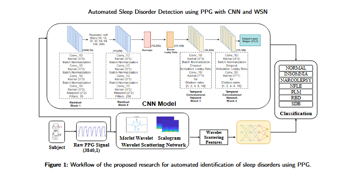

# Sleep Stage Classification and Deep Analysis using PPG Signal

This project focuses on the classification and analysis of sleep stages using Photoplethysmography (PPG) signals. The research aims to develop accurate methods for sleep disorder detection and classification through advanced signal processing and machine learning techniques.

## Project Overview

Sleep disorders affect millions of people worldwide and can lead to serious health problems if left undiagnosed and untreated. Traditional sleep monitoring methods like polysomnography (PSG) require specialized equipment and clinical settings. This project explores the use of PPG signals, which can be easily acquired using wearable devices, as an alternative approach for sleep stage classification and sleep disorder detection.

## Workflow

The project follows a comprehensive workflow for sleep stage classification:

1. **Problem Definition**: Identifying the need for accessible sleep stage classification methods
2. **Data Collection**: Gathering PPG signal data from subjects during sleep
3. **Data Preprocessing**: Cleaning and preparing the PPG signals for analysis
4. **Exploratory Data Analysis (EDA)**: Understanding patterns and characteristics in the data
5. **Model Selection**: Choosing appropriate machine learning and deep learning models
6. **Model Training**: Training the selected models on the preprocessed data
7. **Model Evaluation**: Assessing model performance using appropriate metrics
8. **Model Optimization**: Fine-tuning models to improve accuracy
9. **Model Deployment**: Implementing the models for practical use
10. **Monitoring and Maintenance**: Ensuring continued model performance
11. **Documentation and Reporting**: Recording methodologies and findings
12. **Feedback Loop**: Incorporating feedback for continuous improvement

## Methodologies

The project employs several advanced signal processing and machine learning techniques:

### Signal Processing Techniques
- **Discrete Wavelet Transform (DWT)**: For time-frequency analysis of PPG signals
- **Empirical Mode Decomposition (EMD)**: For adaptive signal decomposition
- **Heart Rate Variability (HRV) Analysis**: For extracting cardiac features
- **Wavelet Scattering Network (WSN)**: For extracting robust features from PPG signals

### Machine Learning Models
- **VGGNet-based Deep Learning**: Custom neural network architecture for PPG classification
- **Multi-class Classification**: For distinguishing between different sleep stages and disorders
- **CNN Architecture**: Specialized convolutional neural network for sleep disorder detection

## CNN Model Architecture

The proposed CNN model for sleep disorder classification has the following architecture:

| Layer/Block | Description | Shape |
|-------------|-------------|-------|
| Input | Input shape adjusted based on the PPG signal | (3840, 1) |
| Residual Block | 1D-Convolution (filters, 3) → BatchNorm → Leaky ReLU → Add shortcut → Max Pool (2) for filters in [16, 16, 32, 32, 64, 64, 128, 256] repeated eight times | (3840, 16) |
| Reshape | Group data into 15 windows | (15, 256) |
| Time-Distributed Dense | Dense (128, activation='Leaky Relu') | (15, 128) |
| TCN Block | 1D-Convolution (128, 7, dilation_rate) → BatchNorm → Leaky ReLU → Dropout (0.2) → Add shortcut for dilation rates in [1, 2, 4, 8, 16] repeated twice | (15, 128) |
| Fully Connected Layer | 1D-Convolution (7, 1, activation='softmax') | (15, 7) |
| Output | Select class with highest prediction | (15, 1) |

The model processes 30-second PPG signals with a shape of (3840, 1) and consists of:

1. **Feature Extraction Block**: Eight stacked Residual Convolutional (ResConv) blocks with 1D convolutions, batch normalization, Leaky ReLU activations, and MaxPooling layers.
2. **Windowing Layer**: Reshapes the output to establish temporal windows, preparing data for the TCN blocks.
3. **Temporal Convolutional Network (TCN) Blocks**: Two TCN blocks with dilated convolutions to capture long-term dependencies in the sequence data.
4. **Output Layer**: 1D convolutional layer with softmax activation for final classification.

## Training and Performance

The CNN model was trained with the following specifications:
- Batch size: 24
- Training/Testing split: 80%/20%
- Learning rate: 0.001
- Optimizer: Adam
- Hardware: NVIDIA-RTX A4000 GPU with 64GB RAM
- Training epochs: 80
- Implementation: Python 3.10 with TensorFlow and scikit-learn

## Results

The model's performance was evaluated using 79,074 PPG epochs collected from 77 participants, including healthy individuals and those with six different sleep disorders:

### Performance Metrics
- **CNN-based Model**: 93.42% overall accuracy, 0.91 Kappa value
- **WSN-based Model with KNN classifier**: 81.8% accuracy, 0.75 Kappa value

### Misclassification Rates (CNN Model)
- Healthy: 7.1%
- Insomnia: 13.65%
- Narcolepsy: 15.36%
- NFLE (Nocturnal Frontal Lobe Epilepsy): 5.59%
- PLM (Periodic Limb Movement): 6.72%
- RBD (REM Sleep Behavior Disorder): 3.53%
- SDB (Sleep-Disordered Breathing): 3.3%

### Misclassification Rates (WSN Model)
- Healthy: 46.2%
- Insomnia: 26.9%
- Narcolepsy: 44.5%
- NFLE: 9.4%
- PLM: 38.1%
- RBD: 10.4%
- SDB: 7.1%

The CNN-based approach significantly outperformed traditional machine learning methods using WSN features, demonstrating the effectiveness of deep learning for sleep disorder classification from PPG signals.

## Project Structure

- **hrv/**: Jupyter notebooks for heart rate variability analysis and model implementation
  - `PPGVGGNet.ipynb`: Implementation of VGG-based neural network for PPG classification
  - `data_analysis.ipynb`: Exploratory data analysis of PPG signals
  - `dwt_ppg.ipynb`: Discrete Wavelet Transform analysis of PPG signals
  - `emd_ppg.ipynb`: Empirical Mode Decomposition analysis of PPG signals

- **matlab codes/**: MATLAB implementations for signal processing and data extraction
  - Data extraction from EDF files
  - Signal visualization
  - Wavelet scattering analysis
  - PPG signal preprocessing

## Sleep Stage Classification

The project focuses on classifying sleep into different stages:
- Wake
- Light Sleep (N1, N2)
- Deep Sleep (N3)
- REM Sleep

Additionally, the system aims to detect sleep disorders such as:
- Sleep Apnea
- Insomnia
- Narcolepsy
- Nocturnal Frontal Lobe Epilepsy (NFLE)
- Periodic Limb Movement (PLM)
- REM Sleep Behavior Disorder (RBD)
- Sleep-Disordered Breathing (SDB)

## Requirements

- Python 3.x
- PyTorch
- TensorFlow
- NumPy
- SciPy
- Matplotlib
- EMD-signal
- scikit-learn
- MATLAB (for WSN analysis and some preprocessing steps)

## Future Work

- Integration with wearable devices for real-time sleep monitoring
- Expansion of the dataset to improve model generalization
- Development of a user-friendly interface for sleep analysis
- Validation in clinical settings
- Exploration of additional deep learning architectures for improved accuracy

## License

This project is licensed under the terms of the included LICENSE file.
